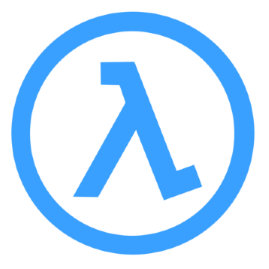
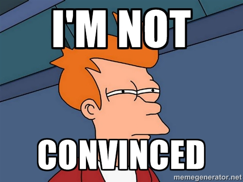
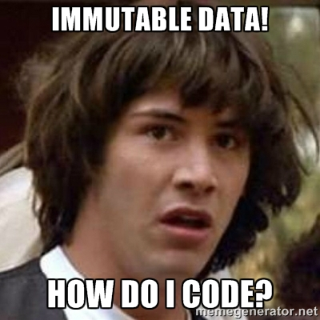

- title : Functional Programming with F#
- description : Intro to Functional Programming with F#
- author : Dawson
- theme : black
- transition : slide

***

## Functional Programming ##
(with F#)

***

## Where are we going? ##

1. What is Functional Programming?
2. Why would you use it?
3. Core Concepts

***

#### What is ####
## Functional Programming? ##

' Lots could be said about what Functional Programming is. In fact, lots has been said! But
' I think it can be boiled down into two main concepts: 
' - High-order functions or First Class functions
' - Absense of Side Effects

***

### Higher-Order Functions ###

$ (\tau_{1} \to \tau_{2}) \to \tau_{3} $

' A high-order function is a function that:
' - takes a function, or
' - returns a function

***

#### NO ####
# Side Effects #

' - In mathematics, a function takes a parameter and returns a single value
' - Every time the function is called it returns the same value!
' - Pure functional programming requires absolutely no mutation whatsoever

--- 

	[lang=cs]
	private int _sum = 0;
	public void AddValues(List<int> nums)
	{
		foreach (var n in nums)
		{
			// any mutation is illegal in a pure functional program
			_sum += n; 
		}
	}

---

Is that it? I can do this with C#/Java/JavaScript!

' You're right! You can use Functional Programming in any language since it's a paradigm, 
' not a language in itself.
' Languages designed to be functional help because their syntax aids you to think functionally.

---

Fine. But... IMMUTABLE data?

' Fear not, I will show you. But first, an F# primer!
	
***

#### Quick ####
# F# Primer #

---

### Defining "Variables" ###

    let name = "Dawson Kroeker"
    let age = 32
	
---

### Collections ###

    let kidsAgesInJune = [2; 5; 6]
    let kidsAgesAsOfJuly = 0 :: kidsAgesInJune
    let years = seq { 1983 .. 2064 }
    
---

### Functions ###

    // define a function with two parameters
    let fullname first last = sprintf "%s %s" first last
    
    // call the function
    fullname "Dawson" "Kroeker"
    // val it : string = "Dawson Kroeker"

---
    
    // multiline functions are indented
    let evens values =
        let isEven x = x % 2 = 0 // nested function
        Seq.filter isEven values
        
    // "pipe" the output of one operation into another
    let sumOfEvens values = 
        values |> evens |> Seq.sum
        
    // without piping
    let sumOfEvensWithoutPiping values = 
        Seq.sum (evens values)
        
---

### Complex Types ###

    // tuples
    let coord = 123,456
    let threeTuple = "a",1,false
    
    // record types with named fields
    type Person = {Name : string; Age : int}
    let emma = {Name = "Emma"; Age = 7}
    
    // union types
    type FamilyMember =
        | Child of Person
        | Parent of Person

---
		
### Concurrency ###

    let doSomething x = printfn "Running %i" x

    let task = async { doSomething 1 }

    let tasks = 
        [ for i in 1 .. 40 -> async { doSomething i } ]
        |> Async.Parallel		
        
***

#### Functional Programming ####
# Concepts #

***

- data-background : images/curry.jpg

## Currying ##

	// function with one parameter
	let printParameter x =
		printfn "x=%i" x

' - Currying - not about curry spice, actually named after a guy named Haskell Curry who did a bunch of Math work in combinatory logic
' - Mathematical functions take only one parameter, does this mean FP languages can only accept one parameter?
' - No!

---

"Fake" multiple parameters by returning a function:

	let printTwoParameters x  =  	 // only one parameter
		let subFunction y =			 // new inner function with one param
			printfn "x=%i y=%i" x y  
		subFunction                  // return the inner function
		
---

Curried Function:

	// function that takes 2 parameters (sort of)
	let printTwoParameters x y =
		printfn "x=%i y=%i" x y
		
 

Could call this with one parameter:

	printTwoParameters 1 // returns a function!

***

### Partial Application ###

    let add x y = x + y
    let addOne = add 1
    let twoPlusOne = addOne 2
    // val twoPlusOne : int = 3
    
---

Breaking it down:

    
    let add x y = x + y
    // val add : x:int -> y:int -> int
    
    let add2 x =
        let addInner y =
            x + y
        addInner
    // val add2 : x:int -> (int -> int)
    
    let addOne = add 1
    // val addOne : (int -> int)
    // returns addInner with x set to 1

***

- data-background : images/recursive.jpg

## 
Recursion
 ##

***

### Immutability and Loops ###

	[lang=cs]
	public static int Sum(IEnumerable<int> values)
	{
		var sum = 0;
		foreach (var v in values)
		{
			sum += v; // illegal in a pure functional language
		}
		return sum;
	}
	
--- 

### Same loop without any mutation ###

	let sum values =
		let rec calcSum total remainingValues = 
			match remainingValues with
			| [] -> total
			| x :: xs -> calcSum (total + x) xs
		calcSum 0 values
		
---

Even Easier

	List.sum [1;2;3;4;5]
	
' You will find that a lot of common patterns are encapsulated in methods included with FSharp. 
' The Functional Way is to abstract common behaviour into pure, high-level functions

***

## Commonly Used Functions ##

|-------------------------------------------|-----------------------------------------|------------------------------------------|
| List.filter  	| Seq.filter  | Array.filter |
| List.fold		| Seq.fold	  | Array.fold   |
| List.iter		| Seq.iter	  | Array.iter   |
| List.map		| Seq.map	  | Array.map    |
| List.reduce	| Seq.reduce  | Array.reduce |

***

## Sites you must visit ##

1. [http://fsharpforfunandprofit.com/ *](http://fsharpforfunandprofit.com/)
2. [http://www.tryfsharp.org/](http://www.tryfsharp.org/)
3. [http://fsharp.org/](http://fsharp.org/)

  

* Note: I stole a LOT of material from here for this presentation.

***

# Questions? #